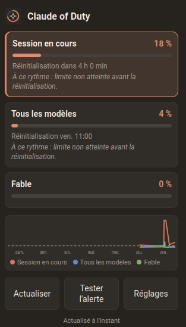

# Claude of Duty

> [!IMPORTANT]
> This extension does not know your login credentials. It never reads, stores or transmits your password or session token.

## Description

The Claude of Duty Firefox extension monitors your Claude plan usage and notifies you at 5% increments as you approach a limit. At least one browser tab must be logged into your claude.ai account.

<div align="center"></div>

## What it watches

It monitors three limits, triggering a notification each time the alert step is crossed and when the limit resets:

- Current session: the 5-hour rolling window (reset time shown in hours).
- All models: the weekly limit across all models (reset time shown in days).
- Scoped model: the weekly limit for the model currently subject to one, labelled with that model's own name. If the model changes, the label updates automatically.

The alert step defaults to 5% and can be changed to 10% or 25% from the extension's preferences page (right-click the toolbar icon, then "Manage Extension" > "Preferences", or `about:addons`). When any limit crosses a step, the alert window opens showing all three limits together, not just the one that changed.

## In the popup

- Each meter shows a progress bar and its reset time. The current session row is visually highlighted, since it resets much sooner than the weekly ones.
- Once there is enough history, a trend line below each meter shows either "On track for reset." or "At this rate: limit in ~Xh", from a simple linear projection of its recent readings.
- A 7-day chart plots the session limit's history as a line, with a dashed line at the configured alert step.
- The toolbar icon always shows the current session usage as a badge, colored green below 70%, orange from 70% to 89%, and red from 90% up.

## How it works

It calls the `GET /api/organizations/{id}/usage` endpoint of the claude.ai API using the session cookie (without actually accessing the cookie's contents). It automatically detects your organization via `/api/organizations`. It performs periodic checks in the background, upon browser startup, and on demand via the popup window.

## Install

Download the latest signed release from [addons.mozilla.org](https://addons.mozilla.org/fr/firefox/addon/claude-of-duty/)

## Developers

1. Build the archive:

   ```bash
   ./build-firefox.sh
   ```

   This creates unsigned `firefox-release/claude-of-duty.xpi`.

2. Use **Firefox Developer Edition** or **Nightly**: set `xpinstall.signatures.required` to `false` in `about:config`, then install the file from `about:addons`.

Quick test instead: open `about:debugging`, "Load Temporary Add-on...", and pick `src/manifest.json`.

## Permissions

- `storage`: remember the last notified step and latest readings.
- `alarms`: schedule the periodic poll.
- `https://claude.ai/*`: read your usage from the Claude API.

The alert window uses `browser.windows`, and the toolbar badge uses
`browser.browserAction`; neither needs a permission of its own.

## Privacy and security

Your Claude credentials never pass through the extension.

| Question | Answer |
| --- | --- |
| Does it ask for or store your password? | Never. There is no login form anywhere in the extension. |
| Can it read your session token? | No. The session cookie is `httpOnly`, so it is invisible to every script, including this one. |
| How does it authenticate then? | Like the Claude website itself: the browser attaches your existing cookie automatically (`credentials: "include"`). The code never touches the cookie value. |
| Where does your usage data go? | Nowhere. It stays in your browser's local storage. |
| Does it contact any other server? | No. It only ever talks to `claude.ai`. |
| Analytics or telemetry? | None. |

The full source is in this repository under the MIT license, so you can check
exactly what it does.

## Releasing and updates

Once the add-on is listed on addons.mozilla.org (AMO), Firefox updates it
automatically. There is no `update_url` to manage: Mozilla hosts every version
and rolls it out to installed copies.

To publish a new version:

1. Bump `"version"` in `src/manifest.json` (for example `1.0.1`).
2. Move the `Unreleased` notes in `CHANGELOG.md` under the new version.
3. Commit, then tag and push the tag:

   ```bash
   git tag v1.0.1
   git push origin v1.0.1
   ```

4. The `Release to AMO` workflow submits the new version. After review, Firefox
   rolls it out on its own.

That workflow needs two repository secrets, taken from your AMO API credentials
(addons.mozilla.org, Tools, Manage API Keys):

- `AMO_JWT_ISSUER`
- `AMO_JWT_SECRET`

`web-ext lint`, the same linter AMO uses, runs on every push.

## Tests

Run the unit tests with Node, no dependencies needed:

```bash
./tests/run-all.sh
```

They cover the usage parsing, the meter mapping (including the scoped model),
the reset formatting, the bucket logic (including a configured alert step),
the badge color thresholds, and the history pruning, entry building, and
linear projection behind the trend line. `readingsFromUsage` also warns in
the console if the API response stops looking the way it expects, which is the
usual sign of an API change.

## Localization

The interface and alerts are available in English and French, following your
browser language.

## License

[MIT](LICENSE).
